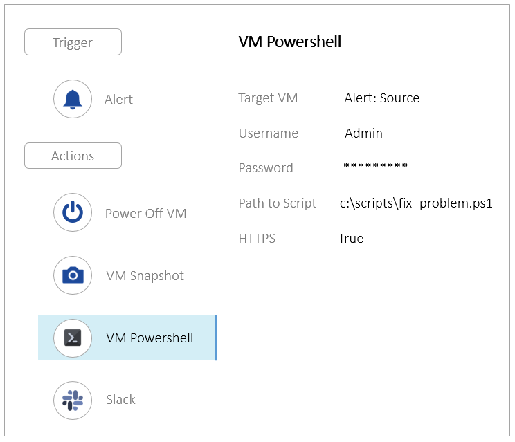
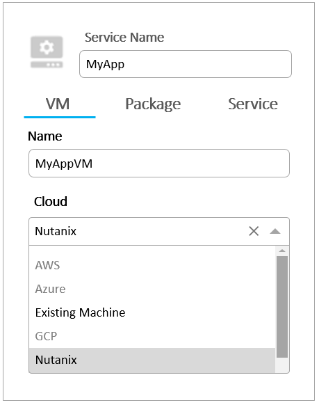
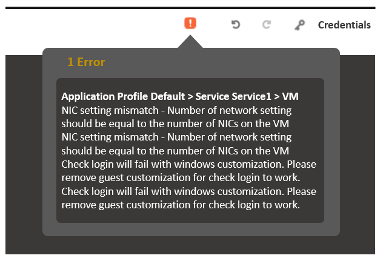

## NCP-MCA: Nutanix Certified Professional - Multicloud Automation

#### 1. In order to give Consumers the ability to modify attributes, what should the Blueprint creator implement in the design?

- [ ] Custom actions
- [ ] eScript task with custom macros
- [x] Runtime variables
- [ ] HTTP task with built-in macros

#### 2. Refer to the exhibit.

#### The Playbook is designed to execute a script, in order to fix a known problem in the application. However, it keeps failing.
#### Why is this Playbook continuing to fail?

- [ ] Slack configuration should be reviewed.
- [ ] The script is incorrect.
- [x] The Playbook actions are in the wrong order.
- [ ] Not enough storage space in order to take a snapshot.

#### 3. Which action should an administrator use to request a static IP address from an IPAM solution?

- [ ] Profile
- [ ] Pre-create
- [ ] Guest Customization
- [x] Create

#### 4.Refer to the exhibit
 

#### What needs to be done in order to enable the developer to complete this requested task? (Choose two.)

- [x] Create AWS and Azure Providers
- [x] Add the Providers to the Project
- [ ] Enable Environment for AWS and Azure
- [ ] Upgrade Calm to version 3.2.x

#### 5. A company is new to automation and has infrastructure they would like to automate with Calm to provide standardized automation. The company also wants to create a Hybrid Cloud environment with their existing infrastructure which includes AHV, Azure, AWS, and a small legacy vSphere environment.
#### In which two locations can Calm be deployed? (Choose two.)

- [ ] vSphere Essential Edition
- [x] VMware ESXi
- [x] Nutanix AHV
- [ ] Any Public Cloud

#### 6. An administrator wants to be alerted when production VMs become idle. The VMs will be determined to be idle when CPU usage is lower than 5% for more than 5 minutes. All affected VMs are categorized as Environment:Production, since they have Flow microsegmentation rules.
#### What should the administrator do to satisfy this requirement? (DOUBT)

- [ ] Create an alert for all VMs, create a Playbook with this alert as the trigger and send an email as the action.
- [ ] Create an alert for VMs in the correct category, create a Playbook with this alert as the trigger > take a snapshot > send an email  as the action.
- [ ] Create an alert for all VMs, create a Playbook with this alert as the trigger > reduce 1 CPU > send an email as the action.
- [x] Create an alert for VMs in the correct category, create a Playbook with this alert as the trigger and send an email as the action.

#### 7. A developer has a Development Blueprint that performs the following high level items:
#### Creates a Windows and Ubuntu Server.

#### Installs IIS on Windows -

#### Installs MySQL on Ubuntu -
#### As part of Development, there is a need for an Operator to restart IIS Services for troubleshooting purposes.
#### How should the developer add this functionality to the Blueprint?

- [x] Add an Execute Task in the Restart Action of the Application Profile.
- [ ] Add an Execute Task in the Restart Action of the Windows/IIS Service.
- [ ] Add a Delay Task in the Restart Action of the Windows/IIS Service.
- [ ] Create an Endpoint for the IIS server and a Runbook that restarts the service.

#### 8. An administrator receives the following error while running a script through Calm on VM:
    Connection refused
#### Which two conditions could cause this issue? (Choose two.)

- [x] The VM port is not allowed by the firewall.
- [ ] The credentials have insufficient permissions.
- [x] The VM is still in the boot process.
- [ ] There is an error in the script.

#### 9. When creating a blueprint, which Pre-create and Post-delete tasks are valid?

- [ ] Create, Start, Stop, Delete
- [x] Execute, Set variable, HTTP, Delay
- [ ] Create, Start, Stop, Soft Delete
- [ ] Execute, Set variable, API, Delay

#### 10. Which two groups of operations can a Prism Admin or Super Admin role perform? (Choose two.)

- [ ] Create, read, automate, or delete an action template in the action gallery
- [x] Create, read, update, or delete an action template in the action gallery
- [ ] Create, read, automate, delete, enable, and run playbooks
- [x] Create, read, update, delete, enable, and run playbooks

#### 11. A blueprint was developed for deploying a standard 3-tier hosting environment for a company's applications. The blueprint includes a load balancer, multiple web servers, a database server, and a small test application.
#### During testing of the blueprint, the application fails to connect to the database. The cause is found to be the database software is still installing when the application starts.
#### Which method most efficiently prevents the application from starting before the database?

- [ ] Use a local install instead of downloading
- [ ] Create a loop to retry connection
- [x] Create a service dependency
- [ ] Use a sleep statement in a start script

#### 12. Which Prism Central setting must first be configured in order to add users to a Project?

- [ ] HTTP Proxy
- [x] Authentication Directory
- [ ] Pulse
- [ ] Local User Role Mapping

#### 13. A customer is trying to deploy an application with Calm and receives this error for a Linux VM:
    script execution has failed with error dail tcp: lookup
    dummy on <dns_ip_in_pc>:53 server misbehaving
#### What is the cause of this error within the blueprint?

- [ ] Connection section has a network adapter selected for the Address box in Connection section.
- [ ] Connection section has no network adapters selected for the Address box in Connection section.
- [ ] Connection Type has a protocol selected.
- [x] Connection Type has no protocol selected.

#### 14. Which method will result in unique names per VM when scaling out a Service in a Calm Blueprint?

- [ ] Guest OS customization using sysprep contains <ComputerName>@@{name}@@</ComputerName>.
- [x] Service VM Name field contains the macro variable @@{calm_array_index}@@.
- [ ] Call an external Python eScript that uses an IPAM API to register the VM name in DNS.
- [ ] Set the VM Name field to allow user edits at launch so the user can enter a custom value at launch.

#### 15. Which two providers are supported in Calm? (Choose two.)

- [ ] Oracle Cloud
- [x] Kubernetes
- [x] GCP
- [ ] IBM Cloud

#### 16. An administrator has created a task for a blueprint that could be applied to another blueprint. The administrator wants to reuse the task with the least amount of effort.
#### How can the administrator accomplish this?

- [ ] Publish the task to Github select the task from the Github Repository from the other blueprint.
- [ ] Publish the task to the Marketplace, select the task from the Marketplace from the other blueprint.
- [ ] Publish the task to the Task Repository, select the task from the Task Repository from the other blueprint.
- [x] Publish the task to the Task Library select the task from the Task Library from the other blueprint.

#### 17. During the deployment of a multi-step Blueprint, a failure is encountered. The administrator corrected the failed step and saved the Blueprint.
#### What should the administrator do next?

- [ ] Delete the failed application and Launch a new application.
- [ ] Soft Delete the failed application and Launch a new application.
- [ ] Use Continue in the failed application to retry.
- [x] Upon clicking Save the Blueprint task will be retried automatically.

#### 18. An administrator has a vendor-provided script that must be run at 9 am every Saturday on a Linux application VM.
#### The administrator currently has a playbook that has a Time trigger and a VM SSH action to execute the script. However, the administrator has received a request to have the output of the script emailed to the application team when it is executed.
#### What is the easiest way to satisfy this request?

- [ ] Modify the script to include a function to format the output of the script and email the output to the desired address.
- [ ] Add an Email action to the end of the existing playbook and use the {{action [index].response_body}} parameter in the Message field.
- [x] Direct the output of the script to a file and use the Send Email with Payload action at the end of your existing playbook.
- [ ] Add an Email action to the end of the existing playbook and use the {{action[index] .stdout}} parameter in the Message field.

#### 19. An administrator has been tasked with creating a multicloud, three-tier application using Calm. The application needs to consist of:

#### A MongoDB backend database -
#### A NodeJS Javascript runtime environment

#### An NGINX webserver -
#### The administrator has access to an AWS account, as well as a locally hosted Nutanix cluster. The three parts of the application should be fully redundant, and be able to tolerate either a cloud provider outage, or a local Nutanix cluster outage.
#### What is the most appropriate solution the administrator should choose in order to meet the requirements?

- [ ] Create a Calm blueprint with MongoDB, Node/S, and NGINX VMs running on Nutanix, as well as an NGINX server running in AWS on US-WEST-1 and US-EAST-1.
- [ ] Create a Calm blueprint with MongoDB, Node/S and NGINX VMs running on Nutanix, and a separate blueprint for MongoDB, NodeJS, and NGINX running in AWS on US-WEST-1 and US-EAST-1.
- [ ] Create a Calm blueprint with MongoDB, NodelS, and NGINX VMs running on Nutanix, as well as MongoDB, NodeJS, and NGINX servers running in AWS on US-WEST-1 and US-EAST-1.
- [x] Create a Calm blueprint with MongoDB, NodelS, and NGINX VMs running on Nutanix, then manually create three EC2 instances for MongoDB, NodeJS and NGINX in AWS running on US-WEST-1 and US-EAST-1.

#### 20. Which permission level grants access to Create, Update, Delete, and Duplicate Blueprints?

- [ ] Consumer
- [ ] Operator
- [x] Developer
- [ ] Domain Admin

#### 21. What are two valid trigger types available for executing Playbooks? (Choose two.)

- [x] Manual
- [x] Alert
- [ ] Report
- [ ] Audit

#### 22. An administrator needs to configure a Prism Central automation task to be notified if production VMs exceed the CPU threshold of 70%.How can this be achieved?

- [ ] Create an NCC alert based on performance data.
- [x] Create an Alert policy for Category Env:Production.
- [ ] Create an Alert policy for all VMs.
- [ ] Create a script from the Guest OS for the alert. 

#### 23. An administrator needs to create a Playbook to be notified when VMs are deleted.
#### Which X-Play Trigger would satisfy this task?

- [ ] Alert
- [ ] Audit
- [x] Event
- [ ] Time

#### 24. When a developer launches the created Blueprint within the Blueprint Editor, the application gets deployed correctly. However, when the Blueprint is launched via Marketplace, it gets a check login error.
#### What is causing this issue?

- [ ] Prism Central can't communicate with Active Directory.
- [ ] The SSH key within the user's laptop is not valid.
- [ ] User is not authorized to launch Blueprints.
- [x] The credential in the Project Environment is invalid.

#### 25. What is the correct syntax for using a macro within a Calm blueprint?

- [x] @@{calm.object}@@
- [ ] %calm.object%
- [ ] {{calm.object}}
- [ ] $_calm.object_$

#### 26. Which Calm feature enables the ability to enforce project quotas for the ESXi hypervisor?

- [ ] Project Environments
- [x] Project Quotas
- [ ] Runbooks
- [ ] Policy Engine

#### 27. An administrator needs to enable Showback in Calm to allow departments to see costs associated with their Projects.
#### Where in Calm would the administrator enable Showback?

- [ ] Marketplace
- [ ] Projects
- [x] Setting
- [ ] LCM

#### 28. What is the correct method to upgrade Calm?

- [ ] Calm Marketplace
- [ ] LCM via Prism Element
- [x] LCM via Prism Central
- [ ] Calm Dashboard

#### 29. An administrator creates a blueprint to deploy VMs to multiple clouds, so that business will remain functional in the event of a disaster.
#### What component describes this feature?

- [x] Service
- [ ] Profile Actions
- [ ] Package
- [ ] Substrates

#### 30. What two pieces of information can an administrator obtain from Plays? (Choose two.)
    DOUBT
- [ ] Host where the action runs
- [x] Start time and end time of each action
- [x] Execution result status
- [ ] CVM IP where the alert was triggered

#### 31. An administrator is configuring Playbooks and is concerned about adding or reducing CPU and memory resources to VMs.
#### Which two prerequisites should an administrator take into consideration when configuring the Playbooks? (Choose two.)

- [x] CPU can be added to a powered on VM if the guest OS supports it
- [ ] VM must be powered off to add CPU
- [x] VM must be powered off to reduce memory
- [ ] Memory can be removed from a powered on VM if the guest OS supports it

#### 32. An end user for an application that has been assigned the Consumer role within the project has noticed multiple issues with a blueprint that need to be addressed. The decision has been made to bring the end user onto the team to be able to modify the blueprints for this project.
#### Using the concept of least privilege, what role should the end user be assigned?

- [ ] Developer
- [ ] Project Admin
- [x] Consumer
- [ ] Operator

#### 33. Refer to the exhibit.

#### Saving the Calm Blueprint gives the validation error for VMware Blueprints shown in the exhibit.
#### What could be the cause of the error?

- [ ] Number of Template vCPU components should be equal to the number of pCPU configured.
- [x] Number of Template NICs components should be equal to the number of Network Settings configured.
- [ ] Number of Template devices components should be equal to the number of Devices configured.
- [ ] Number of Template VMXNET3 components should be equal to the number of Virtual e1000 adapters configured.
